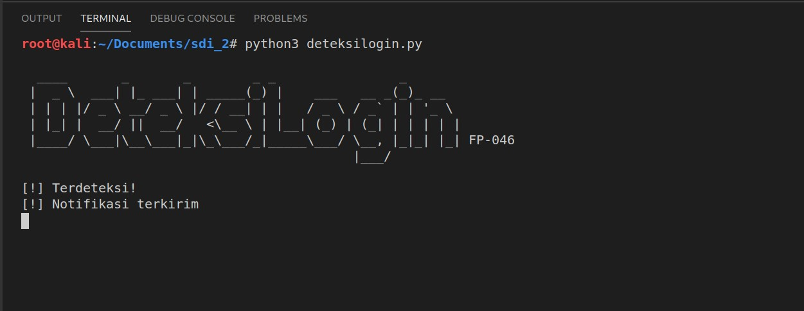

<br />
<p align="center">
  <a href="#">
    
  </a>

  <h3 align="center">DeteksiLogin</h3>
  <p align="center">
    Final Project Sistem Deteksi dan Intrusi
    <br>
    <br>
  </p>
</p>

[](#)  
[](#)  
[](#)  
[](#)

<br>

## Daftar ISi

1. [Deskripsi](#Deskripsi)
2. [Requirement](#Requirement)
3. [Instalasi](#Instalasi)
4. [Cara kerja](#Cara-Kerja)
5. [Penggunaan](#Penggunaan)
6. [Dokumentasi](#Dokumentasi)

## Deskripsi

Perangkat admin pada suatu laboratorium tentu berisi sekumpulan data dengan hak akses terbatas, dimana hanya pihak administrator atau otoritas terntentu saja yang diizinkan untuk menggunakan perangkat tersebut. Keterbatasan hak akses tersebut dapat memungkinkan terjadinya percobaan intrusi oleh pihak yang tidak bertanggung jawab. Oleh karenanya, maka munculah ide untuk membuat program pendeteksi intrusi yang bernama DeteksiLogin, yang memungkinkan user mengetahui aktivitas login attempt pada suatu perangkat, kemudian mengirimkan notifikasi terkait percobaan intrusi tersebut secara langsung ke whatsapp administator. Program DeteksiLogin ini berjalan pada sistem operasi linux, yang biasa digunakan pada laboratorium.

## Requirement

| Req.                     | Ver. Used / Model |
|--------------------------|-------------------|
| Linux OS                 | Any Distro        |
| Python Lang              | 3.9.1             |
| Twilio Python Lib        | 6.51.0            |
| Whatsapp App             | 2.20.206.24       |
| Android OS               | 10                |

## Instalasi

Untuk menggunakan program DeteksiLogin, user perlu menginstall library terlebih dahulu, sesuai yang tertera pada section [Requirement](#Requirement) dan beberapa konfigruasi sebagai berikut.

1. Pastikan user menggunakan versi poython 3, jika belum maka disarankan update terlebih dahulu: https://linuxize.com/post/how-to-install-python-3-9-on-ubuntu-20-04/

```
sudo apt install python3.9
```

2. Twilio: https://www.twilio.com/docs/libraries/python

```
pip install twilio
```
3. Registrasi akun twilio, lalu join ke sandbox whatsapp twilio. Kemudian copy account sid beserta auth token user ke program DeteksiLogin. Lihat https://www.twilio.com/

## Cara Kerja

Cara kerja program ini diawali dengan mengecek aktivitas login attempt pada log yang tersimpan di `/var/log/btmp` dengan menggunakan perintah `lastb -s -5sec`, dimana parameter `-s -5s` berarti hanya log di waktu tersebut selama 5 detik terakhir saja yang akan dilihat program. Berikut merupakan contoh outputnya:

```
root     tty8         :1               Sat Jan 16 09:45 - 09:45  (00:00)
```

Output diatas menunjukkan login attempt yang dilakukan di tanggal tersebut pada Pukul 09:45. Informasi terkait log tersebut disimpan pada variabel `output`, lalu diubah tipe datanya menjadi string dan disimpan kembali pada variabel `conv`.

Program dilanjutkan dengan mengecek waktu setempat, kemudian menyimpannya dalam format `jam:menit` pada variabel `dt_string`. Jika diumpamakan waktu setempat saat ini yaitu pukul 09:45, maka string value `dt_string` adalah 09:45. Kemudian program perlu mengecek apakah terdapat login attempt pada pukul 09:45 tersebut. Caranya yaitu dengan mengecek apakah terdapat string value 09:45, pada output log `lastb` tadi, dengan menggunakan fungsi berikut:

```py
if dt_string in conv:
            print ("[!] Terdeteksi!")
        else:
            sleep(5)
```

Dimana fungsi diatas berarti program mengecek apakah terdapat string value pada variabel `dt_string` (yaitu 09:45), pada variabel `conv`. Dapat dilihat pada case disini, ternyata value 09:45 tersebut ada pada variabel conv sebagai berikut:

```
root     tty8         :1               Sat Jan 16 >>>09:45<<< - >>>09:45<<<  (00:00)
```

Dengan demikian, dapat disimpulkan bahwa pada pukul 09:45 selama 5 detik terakhir, telah terjadi login attempt pada perangkat tersebut, kemudian program pun akan mengirimkan notifikasi ke whatsapp administrator melalui fungsi `intruder()`


## Penggunaan

Setelah memenuhi semua konfigurasi yang ada, User dapat menjalankan program DeteksiLogin melalui perintah:

```
python3 deteksilogin.py
```

Jika terdeteksi login attempt pada perangkat, maka program akan menampilkan tanda `[!] Terdeteksi!` pada terminal, kemudian setelah program berhasil mengirimkan notifikasi pada whatsapp administrator, maka akan tampil tanda `[!] Notifikasi terkirim` pada terminal.

## Dokumentasi


